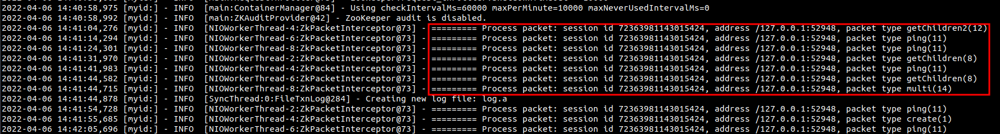

这是一个关于java agent例子，本例可以结合主要用于演示在不侵入源码的情况下对zookeeper请求包进行监控。

本例基于
* jdk 1.8
* zookeeper 3.7.0

使用如下命令编译本例
```
mvn clean package -DskipTests
```
编译成功后，可以在target目录下得到 **JavaAgentExample-1.0-SNAPSHOT.tar.gz** 包。

将JavaAgentExample-1.0-SNAPSHOT.tar.gz上传到zookeeper所在服务器并解压。本例中上传到/root目录，解压后的目录为/root/JavaAgentExample-1.0-SNAPSHOT

加压后，执行如下命令
```
export SERVER_JVMFLAGS="-javaagent:/root/JavaAgentExample-1.0-SNAPSHOT/lib/JavaAgentExample-1.0-SNAPSHOT.jar"
export CLASSPATH=/root/JavaAgentExample-1.0-SNAPSHOT/lib/*:$CLASSPATH
```
执行完成后，启动zookeeper。
之后当有zookeeper客户端连接发送请求时，可以在日志文件中看到如下图所示的信息。


